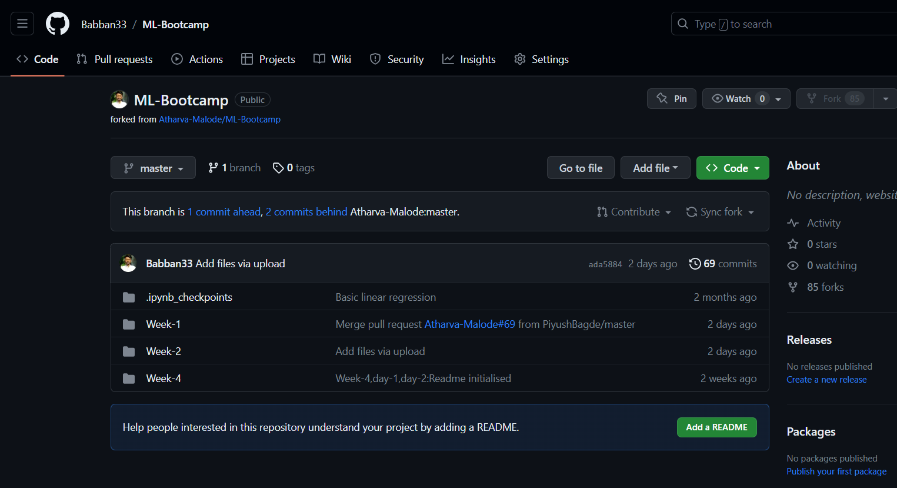
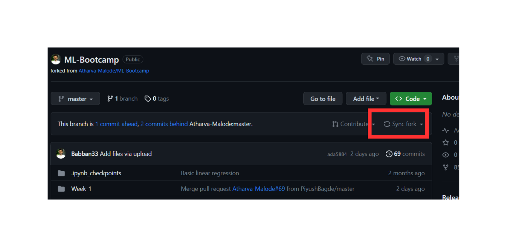
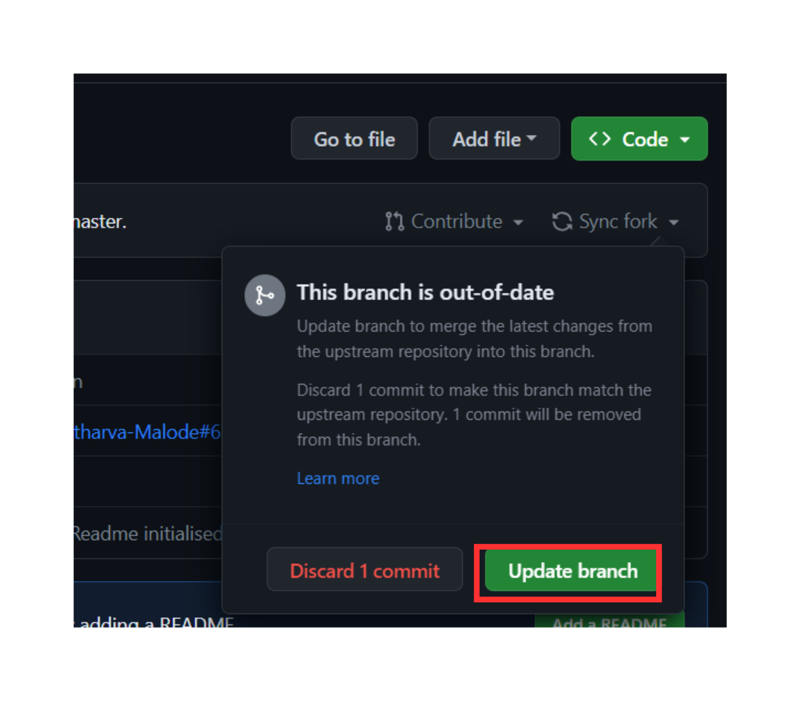
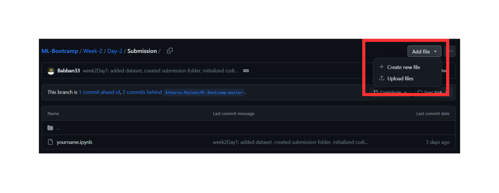
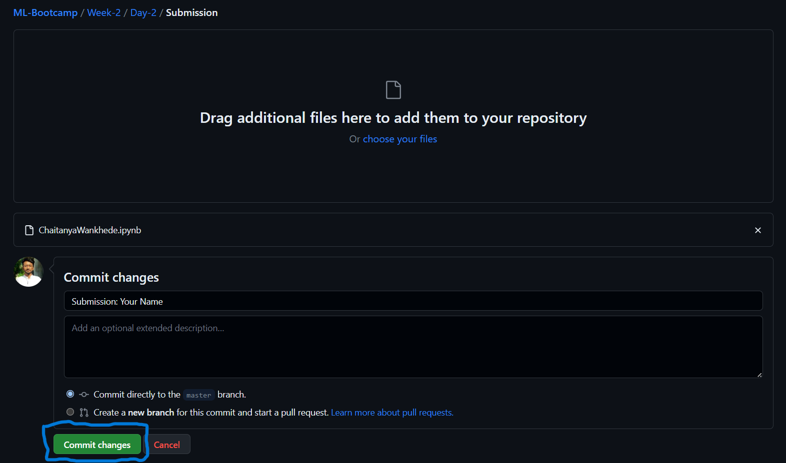
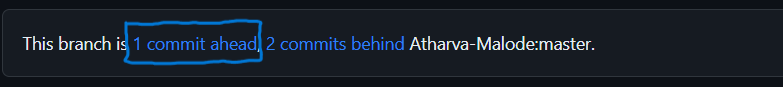

# For submitting your assignments follow these steps:

**Pre-requisites**: You must fork this repository in order to submit your assignments

## **Step 1:** Go to ML-Bootcamp repository present on your account.

## **Step 2:** If your branch few commits behind:
- Click on **sync fork**

- And then click on **update branch**

## **Step 3:** Let's say you want to submit the assignment of week-2 day-2. Then navigate to the folder 
- Week-2 -> Day-2 -> Submissions

## **Step 4:** Click on Add file and then click on upload file

## **Step 5:** Upload your files by **renaming them with your name** and add the commit message as shown and click on Commit changes

## **Step 6:** Go back to your repository and you'll se your repository is "**__ commits ahead**" click on it

## **Step 7:** Click on **Create Pull request**

## **Step 8:** Again click on **Create Pull Request**

 

That's it! You have successfully submitted your assignments.

Our team will verify your code and accpet your assignments. You can see your submissions on the main repository's submission folders.